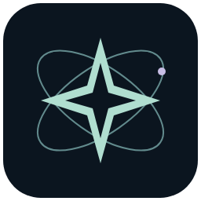
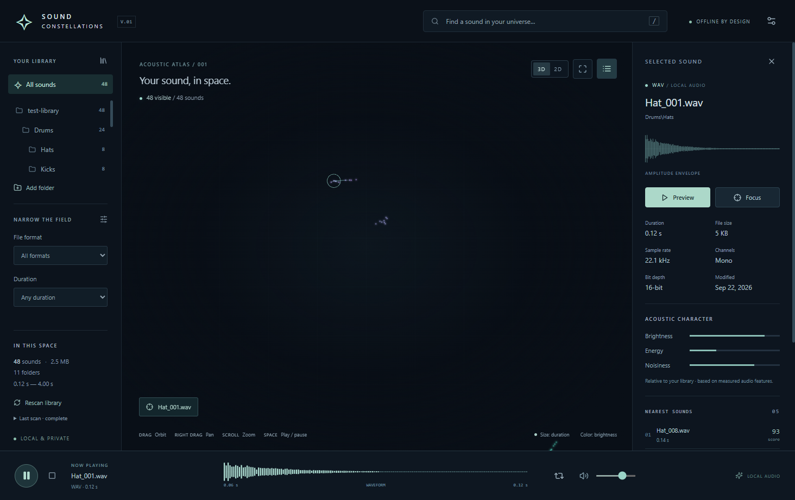

<div align="center">
  
  <h1>Sound Constellations</h1>
  <p><strong>Discover the sounds between your folders.</strong></p>
  <p>A private, offline Windows audio explorer that maps your sample library by acoustic similarity.</p>
  <p><a href="https://github.com/nevchr/Sound-Constellations/releases/tag/v0.1.0">Download for Windows</a> · <a href="docs/INSTALL.md">Installation guide</a> · <a href="docs/DEVELOPMENT.md">How it works</a></p>
</div>



Your audio library has more in common than its folder structure can show. Sound Constellations analyzes your files locally and places acoustically similar sounds near one another in an interactive 3D or 2D map. Click a star, hear a sample, and follow its closest neighbours to your next discovery.

**Your files stay where they are. Your audio stays on your computer.**

## Download and start exploring

**Windows 10/11 · Intel/AMD x64 · No development tools required**

| Download                                                                                      | Best for                                                                                 |
| --------------------------------------------------------------------------------------------- | ---------------------------------------------------------------------------------------- |
| **[Windows installer](https://github.com/nevchr/Sound-Constellations/releases/tag/v0.1.0)**   | Recommended. Guided setup, Start menu and desktop shortcuts, and a standard uninstaller. |
| **[Portable executable](https://github.com/nevchr/Sound-Constellations/releases/tag/v0.1.0)** | Run the same app without installing or creating shortcuts.                               |

Download **Sound-Constellations-Setup-0.1.0-x64.exe**, open it, then choose a sample folder. Everything the app needs is bundled, including the desktop runtime and audio decoder. You do not need Node.js, Python, FFmpeg, or an account to run it. Installation and use work offline after downloading.

This repository is private, so downloading from GitHub requires access. A directly shared installer works without a GitHub account. The initial release is unsigned; Windows may show an unknown-publisher or SmartScreen notice. See the [installation guide](docs/INSTALL.md) for details.

## Built for listening and discovery

- **Explore spatially.** Orbit, pan, and zoom through a constellation of real audio files, or switch to a flatter 2D view.
- **Hear what catches your eye.** Click to preview, inspect the waveform, loop a sound, or use the keyboard to play and pause.
- **Follow acoustic neighbours.** Find nearby matches from measured timbre, energy, spectrum, and duration, with subtle connections between related sounds.
- **Find something specific.** Search names and paths, or narrow the field by folder, file type, and duration.
- **Pick up where you left off.** Cached analysis, incremental rescans, cancellation, and saved settings make repeat visits faster.
- **Keep your originals intact.** Source libraries are read-only. Analysis and preferences live in a separate local cache.

## Local by design

No uploads. No telemetry. No subscription. No cloud audio analysis.

The app uses classical audio features and local mathematics. It does not claim to recognize instruments, infer genres, or understand musical intent. Similarity scores are browsing aids, not certainty estimates.

The scanner supports **WAV, MP3, FLAC, OGG, and M4A**. Generated PCM16 WAV, MP3, FLAC, OGG Vorbis, and M4A AAC fixtures have been tested. Unsupported or damaged files are reported without stopping the rest of the library.

## Under the surface

Local audio → acoustic features → normalization → nearest neighbours → PCA → constellation

Electron, React, TypeScript, Vite, and Three.js power the desktop experience. A background worker handles local FFmpeg decoding, Meyda feature extraction, and deterministic PCA. SQLite stores reusable analysis, while Web Audio handles previews.

The first full test with **5,000 generated WAV files** completed without failures in **8m 46s**. A subsequent worker rescan reused every record in **2.25s**. The packaged application was also tested with all 5,000 sounds and a full process relaunch. These measurements describe this development machine and fixture library; see the [verification report](VERIFICATION.md) for scope and limits.

## Development

Building from source requires Windows x64, Node.js 24+, and pnpm. These are developer requirements, not requirements for people installing the app.

```powershell
pnpm install
pnpm dev
```

```powershell
pnpm test           # Unit tests
pnpm build:win      # Build setup and portable executables, plus checksums
```

Outputs are written to `release/0.1.0/`. See [development documentation](docs/DEVELOPMENT.md) for architecture, DSP details, test data, and integration tests.

## Current scope

Previews cover the first **30 seconds** of a sound. Waveforms for longer files summarize sampled analysis windows. The portable edition also stores preferences and cache in your Windows user profile. ARM Windows and other operating systems are not packaged in this release.

This is an early Windows release. Additional listening tests with varied real sample libraries, clean-machine compatibility checks, and code signing are the next release priorities.

## Third-party software

Bundled components retain their own licenses; see [third-party notices](THIRD_PARTY_NOTICES.md).
